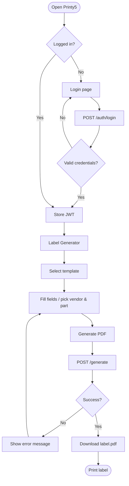
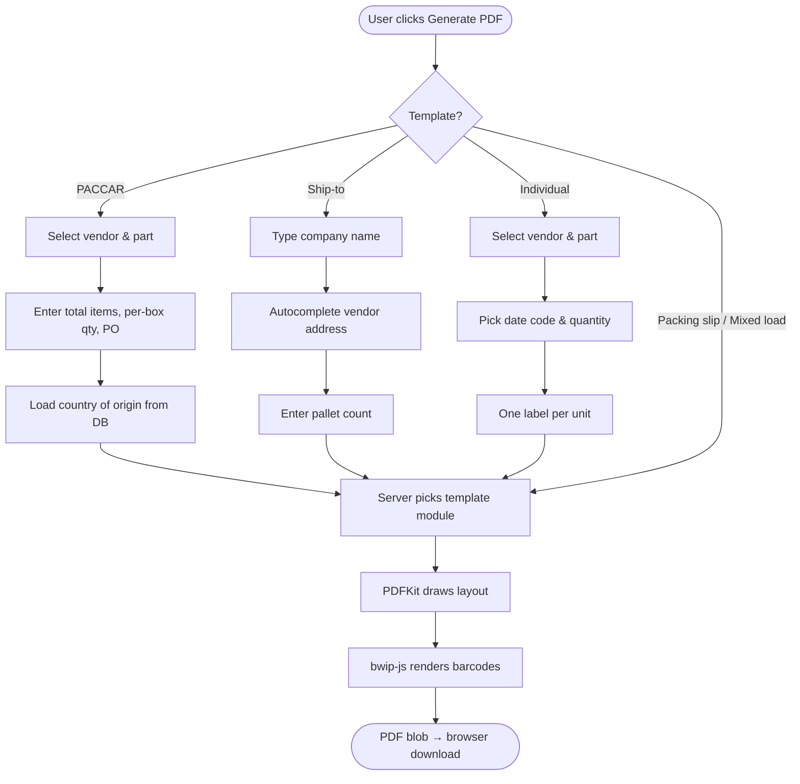
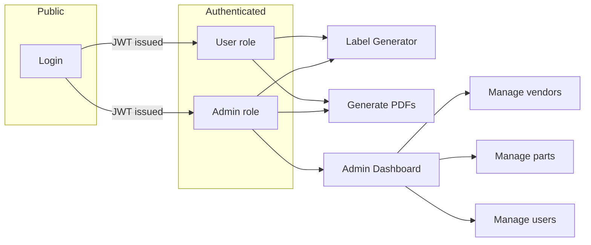
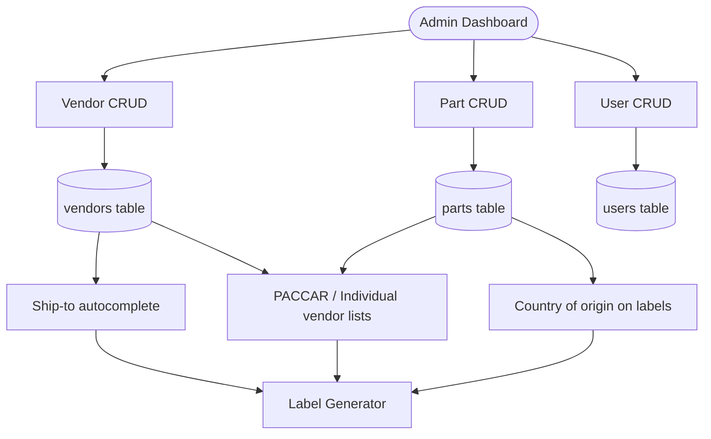
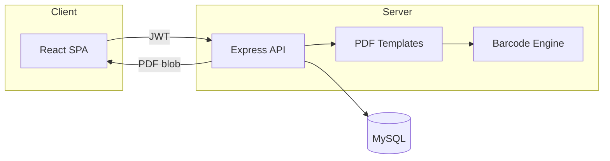
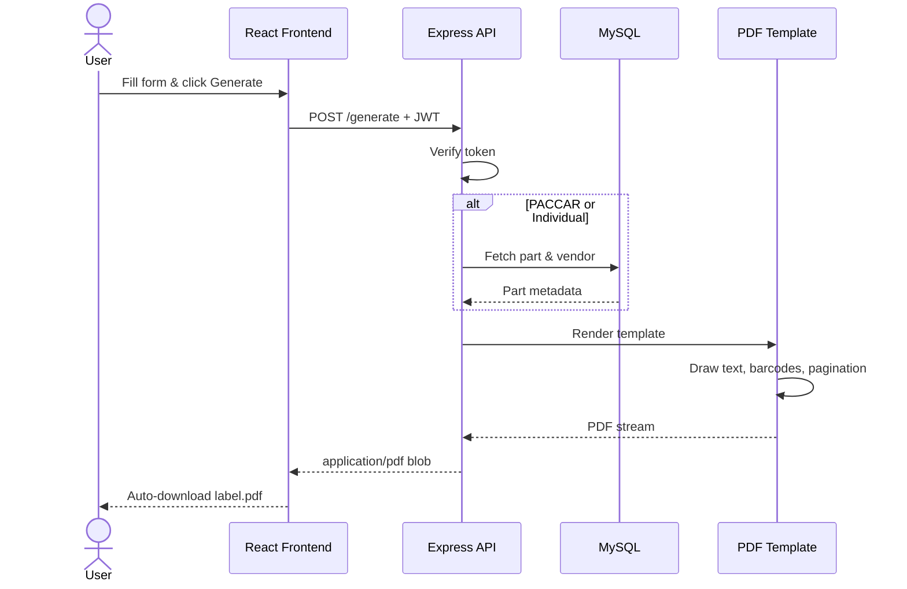

# Printy5 — Industrial Label Generator

> **Production-ready web app for generating print-accurate shipping and compliance labels** — built for manufacturing and logistics teams who need consistent, barcode-ready PDFs in seconds.

[](https://www.printy5.in/login)
[](.)
[](.)

---

## Overview

**Printy5** is a full-stack label generation platform delivered to a **US-based client** for warehouse and shipping operations. Operators log in, pick a label template, fill in order details (or select from a managed vendor/part catalog), and download a **print-ready PDF** — complete with barcodes, country-of-origin fields, and multi-label pagination.

**Live application:** [https://www.printy5.in/login](https://www.printy5.in/login)

---

## Label types

| Template | Use case | Sample output |
|----------|----------|---------------|
| **PACCAR label** | Part-level shipping labels with barcodes, PO, supplier code, serial, and country of origin | [`label.pdf`](label.pdf) |
| **Ship-to label** | Destination address blocks for pallets and cartons | [`label (1).pdf`](label%20(1).pdf) |
| **Packing slip enclosed** | Simple “packing slip enclosed” notice | — |
| **Mixed load label** | Mixed-load shipment identification | — |
| **Individual label** | Per-unit labels with multilingual descriptions (EN / FR / ES) and date codes | — |

### PACCAR label (excerpt)

```
PART NO (P)     MT-445566          QTY (Q)     5100
DESCRIPTION     Drive Shaft Assembly    PO (K)  DKJNE293
SUPPLIER (V)    98765ZX            SERIAL (S)  10001
1 OF 2          COUNTRY OF ORIGIN    MADE IN Canada
```

### Ship-to label (excerpt)

```
SHIP TO:
Digital Barcode
Raviwar Peth
Pune 413322
India
Pallet 1 of 1
```

---

## Features

- **5 label templates** — PACCAR, ship-to, packing slip, mixed load, and individual unit labels
- **Barcode generation** — Code 128 barcodes rendered server-side with `bwip-js`
- **Vendor & part catalog** — Admin-managed database with autocomplete for ship-to addresses
- **Country of origin** — Per-part origin stored in admin; auto-formatted on PACCAR labels
- **Multi-label PDFs** — Automatic pagination (e.g. `1 OF 2`, `2 OF 2`) based on quantity and box capacity
- **Multilingual individual labels** — English, French, and Spanish descriptions with date-code formatting (`SDDMMYYYY`)
- **Role-based access** — JWT authentication with `admin` and `user` roles
- **Admin dashboard** — Manage vendors, parts, and users without touching the database
- **Dark / light theme** — Built-in theme toggle for comfortable warehouse use

---

## Tech stack

| Layer | Technologies |
|-------|--------------|
| **Frontend** | React 19, Vite 7, React Router, Axios |
| **Backend** | Node.js, Express 5, PDFKit, bwip-js |
| **Database** | MySQL 8 |
| **Auth** | JWT + bcrypt |
| **PDF** | Server-side generation (no client-side print libs) |

---

## Application flows

### End-to-end user journey



### Label generation by template



### Authentication & roles



### Admin data flow



---

## Architecture



### Request lifecycle (PDF generation)



```
printing-project/
├── label-generator-frontend/   # React + Vite SPA
│   └── src/
│       ├── pages/              # Login, LabelGenerator, AdminDashboard
│       ├── context/            # Auth state
│       └── api/                # Axios client
├── label-generator-backend/    # Express API + PDF engine
│   ├── routes/                 # auth, admin, vendors, parts, generate
│   ├── templates/              # One module per label type
│   └── sql/                    # Schema & seed data
├── label.pdf                   # Sample PACCAR output
└── label (1).pdf               # Sample ship-to output
```

---

## Getting started

### Prerequisites

- **Node.js** 18+
- **MySQL** 8+

### 1. Database

Create a MySQL database and import the schema (optional — the server also bootstraps tables on startup):

```bash
mysql -u root -p -e "CREATE DATABASE IF NOT EXISTS label_generator;"
mysql -u root -p label_generator < label-generator-backend/sql/label_generator.sql
```

### 2. Backend

```bash
cd label-generator-backend
npm install
```

Create `label-generator-backend/.env`:

```env
PORT=5000
DB_HOST=127.0.0.1
DB_USER=root
DB_PASSWORD=your_password
DB_NAME=label_generator
JWT_SECRET=your_long_random_secret

# Optional — default users are seeded on first run if the users table is empty
ADMIN_INITIAL_PASSWORD=change_me
USER_INITIAL_PASSWORD=change_me
```

```bash
npm start
```

The API runs at `http://localhost:5000`.

### 3. Frontend

```bash
cd label-generator-frontend
npm install
```

Create `label-generator-frontend/.env` (optional):

```env
VITE_API_URL=http://localhost:5000
```

```bash
npm run dev
```

Open `http://localhost:5173` and sign in. On first startup, default `admin` and `user` accounts are created if no users exist — set passwords via `.env` before the first run in production.

### 4. Production build

```bash
cd label-generator-frontend
npm run build
```

Serve the `dist/` folder behind your web server and point `VITE_API_URL` at your deployed API.

---

## API overview

| Method | Endpoint | Description |
|--------|----------|-------------|
| `POST` | `/auth/login` | Obtain JWT |
| `GET` | `/vendors` | List vendors |
| `GET` | `/vendors/search?q=` | Ship-to autocomplete |
| `GET` | `/parts/:vendorId` | Parts for a vendor |
| `POST` | `/generate` | Generate label PDF (body includes `template` and fields) |
| `GET/POST/PUT/DELETE` | `/admin/*` | Vendors, parts, users (admin only) |

---

## Deployment

This project is **live in production** for a US-based logistics client:

| | |
|---|---|
| **URL** | [https://www.printy5.in/login](https://www.printy5.in/login) |
| **Frontend** | Static React build (Vite) |
| **Backend** | Node.js Express API |
| **Database** | MySQL |

---

## Author

**Sanket Karande**  
[sakarande007@gmail.com](mailto:sakarande007@gmail.com)

---

## License

This repository is provided as a portfolio / reference implementation. Contact the author for licensing or commercial use.
